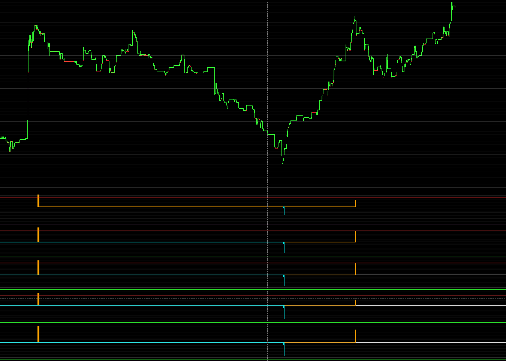

VOL IMPULSE
===========

Vol Impulse is a compact engineering demo for real-time volume-price analysis.
It connects to Binance USD-M Futures, reconstructs market snapshots from
bookTicker and aggTrade streams, infers the price response implied by liquidity
and trade flow, and measures the instantaneous disagreement between observed and
inferred price movement.

The live dashboard is rendered with PySide6 and pyqtgraph. With the numerical
kernels compiled, the algorithm can process millisecond-resolution data while
the UI maintains a stable one-second render cycle (1000 ms by default), keeping
the display responsive under load.

ANALYSIS MODEL
--------------

The pipeline derives multiple signed-flow channels from bid/ask prices,
bid/ask quantities, last trade price, and cumulative traded volume. It then
fits a constrained nonlinear impact law for each channel:

    inferred_move = sign(force) * alpha * max(0, abs(force) - threshold) ** beta

The fitted relationship is evaluated forward to obtain the expected price
move. A local scale factor aligns expected and observed path magnitudes. The
instantaneous normalized inconsistency is:

    score = (observed_move - scaled_expected_move)
            / (abs(observed_move) + abs(scaled_expected_move) + epsilon)

The signed score is bounded approximately to [-1, 1]. Its magnitude describes
the immediate disagreement; its sign shows whether observed price movement is
above or below the movement implied by volume and liquidity. The EGI channels
add multi-window context by locating unusually persistent excess residuals.

FEATURES
--------

- Binance Futures REST bootstrap and WebSocket ingestion
- bookTicker depth and aggTrade volume synchronization
- Historical aggregate-trade backfill and reconnect gap recovery
- Nonlinear volume-to-price impact inversion
- Instantaneous volume-price inconsistency and contextual EGI channels
- Deterministic offline mode that requires no network or GUI
- PySide6/pyqtgraph live dashboard with second-level rendering
- Numba JIT fallback with optional native AOT CPython extensions
- One-command build for every numerical kernel
- English-only source, runtime messages, documentation, and tests

REQUIREMENTS
------------

- Python 3.10 or a compatible CPython version supported by the pinned Numba
  range
- Internet access to Binance for live mode
- A C/C++ toolchain for optional AOT compilation
  - Windows: Microsoft C++ Build Tools
  - Linux: GCC or Clang and Python development headers

Install the Python dependencies:

    python -m pip install -r requirement.txt

QUICK START
-----------

Run the deterministic end-to-end demo without Binance or PySide6 rendering:

    python impulse.py --mode offline

Inspect the active numerical backend:

    python impulse.py --mode backend

Start the live Binance dashboard:

    python impulse.py --mode live --symbol BTCUSDT

The dashboard renders once per second by default. The interval is configurable:

    python impulse.py --mode live --symbol ETHUSDT --render-interval-ms 1000

Use --help to inspect all sampling, model-window, and chart options.

AOT COMPILATION
---------------

The regular installation uses Numba JIT when native modules are not available.
Compile all numerical kernels into native CPython extensions in one command:

    python build.py --force

The build compiles the liquidity-cube, circular-integral, impact-inversion, and
EGI kernels, then verifies them in a clean Python process. Generated extensions
are specific to the operating system, CPU architecture, and CPython ABI.

Backend selection is controlled by VOL_IMPULSE_AOT:

- auto or unset: use AOT when all extensions exist, otherwise use JIT
- 1: require AOT and fail clearly if an extension is unavailable
- 0: force the JIT implementation

Windows PowerShell examples:

    $env:VOL_IMPULSE_AOT = "1"
    python impulse.py --mode offline

    $env:VOL_IMPULSE_AOT = "0"
    python impulse.py --mode offline

Remove generated native extensions with:

    python build.py --clean

TESTS
-----

Run the deterministic unit and pipeline tests:

    python -m unittest discover -s tests -v

The tests intentionally force the JIT backend so they remain portable. The
AOT backend is verified separately by build.py.

PROJECT LAYOUT
--------------

    README.md                      Project documentation and demo screenshot
    impulse.py                     Command-line live/offline entry point
    build.py                       Unified AOT build and verification command
    liba/demo_data.py              Deterministic Binance-shaped demo data
    liba/objs_binance.py           REST, WebSocket, sampling, and backfill
    liba/pulsa_runner.py           Live analysis and visualization coordinator
    liba/kernels/pulsa_data.py     Liquidity and signed-flow feature pipeline
    liba/kernels/pulsa_engine.py   Impact inversion and inconsistency API
    liba/kernels/kernel/           JIT kernels and AOT export specifications
    liba/chart/                    PySide6/pyqtgraph visualization
    tests/                         Offline deterministic tests

PUBLIC API
----------

PulsaEngine.load_data accepts a pandas DataFrame with these columns:

    local_time, symbol, last, bid, bid_vol, ask, ask_vol, volume

The volume column is cumulative. Call latest_inconsistency after loading data
to obtain observed movement, inferred movement, residual, normalized score,
and excess intensity arrays for all derived channels.

Example:

    from liba import PulsaEngine
    from liba.demo_data import generate_synthetic_market_data

    data = generate_synthetic_market_data(512)
    engine = PulsaEngine(capacity=512, tick_size=0.1, max_window=60)
    engine.load_data(data)
    result = engine.latest_inconsistency()
    print(result.peak_score)

DISCLAIMER
----------

This repository is a research and visualization demo. It does not place orders
and does not provide investment advice. Binance availability and data access can
depend on network conditions and regional restrictions.
